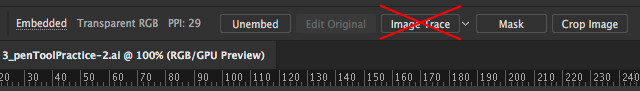
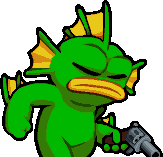

# Homework Two - <small>Pen Tool</small>
## Description
You will use Illustrator to create a vector art rendering of a video game or cartoon character. The focus is on using:

1. Basic geometry (e.g., ellipses and rectangles)
2. The Pen Tool `(P)`
3. The Shapebuilder Tool `(Shift + M)` and Pathfinder
4. The Line Segment Tool `(Backslash)`
5. The Anchor Point Tool `(Shift + C)`
6. The Direct Select Tool `(A)`
7. The `Object > Path` menu

We're not going for exceptional detail or perfection here; we're just learning the basics of vector art and using the pen tool in Illustrator.

## Process

1. Choose a character that is relatively simple in its shape and form, and lends itself well to vector art. Cartoony characters with simple features and few colors are good candidates.
2. Find an image you can use as a reference from Google Images.
3. Place the image into Illustrator using `File > Place`. Make sure it's on its own layer
4. Reduce the opacity of your image's layer, and lock it.
5. On another layer, use the pen tool to trace it.

## Constraints
You are not allowed to use the `image trace` feature in Illustrator; it will defeat the purpose of this exercise. You are allowed to bring in a reference image, but you just trace it with the `pen tool` and NOT with `image trace`:

### Don't use this:

## Choosing a Character
Remember that your character should be geometrically simple with fewer colors and details.

#### Good Choices

Fish from Nuclear Throne:  

Bomberman:  

#### Poor Choices

Solid Snake:  

Alien:  

## Submission - Canvas
I need `a zip file` with two things:

1. Your Illustrator file (`.ai`)
2. Your exported image (`.png` or `.jpg`)

#### **Due Friday Feb 23rd @ 11:59pm**