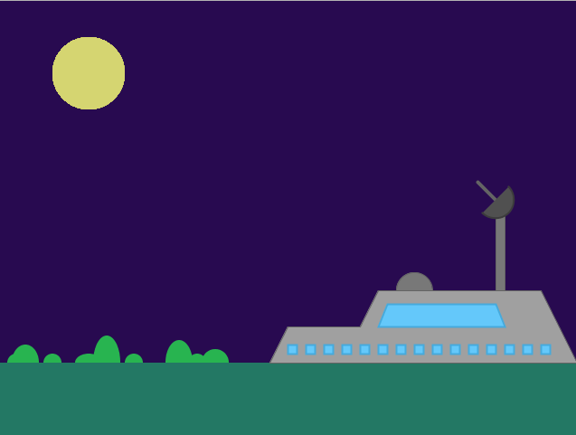

# Project Four --- <small>p5.js illustration</small>
## Description
In this assignment, you will use p5.js to create digital art. The goal is to be comfortable with p5.js shape-drawing methods (_e.g, rect, line, ellipse)_ and create visually-engaging imagery.

__Alternatively:__ you can choose to complete one of Dan Shiffman's [Coding Challenges](https://www.youtube.com/playlist?list=PLRqwX-V7Uu6ZiZxtDDRCi6uhfTH4FilpH). This will involve following a YouTube tutorial for making something fun with p5.js. In this case, you will probably want to do your project in Atom instead of CodePen.

## Requirements
I am flexible about what you want to do. As some of you are not artists, you might consider something more geometrically simple. The following image is a good example of what I might expect from this project:

### p5 skills--- methods and variables
You must use a combination of at least five p5.js methods or variables. Examples of methods are `rect()`, `ellipse()`, `line()`, `stroke()`, `fill()`, and `random()` to name a few. Examples of variables are `width`/`height`, `mouseX`/`mouseY`, `frameCount`, and `mouseIsPressed`.

You should look at the [p5.js reference](https://p5js.org/reference/) to come up with ideas of what skills you will use.

In particular, you might want to be aware of:

 * The [width and height](https://p5js.org/examples/structure-width-and-height.html) variables
 * [fill()](https://p5js.org/reference/#/p5/fill), [noFill()](https://p5js.org/reference/#/p5/noFill), [stroke()](https://p5js.org/reference/#/p5/stroke), and [noStroke()](noStroke())
 * [beginShape()](https://p5js.org/reference/#/p5/beginShape), for drawing custom shapes

### Interactivity
You must have `at least one` means of user interaction. This will usually mean `keyboard or mouse events`. You should check the 'keyboard' and 'mouse' parts of the `Events` section the [p5 reference](https://p5js.org/reference/#group-Events).

For instance, if you are drawing a cityscape that has a moon, you might use the `mouseX` and `mouseY` variables to draw the ellipse at the user's cursor position.

You could also use keyboard events such as [keyPressed](https://p5js.org/reference/#/p5/keyPressed) to control the fill/stroke color of shapes in your drawing.

## Process
### Step One: Fork my pen

  
Starter pen

  <h6 class="card-text">Make sure you're logged in to CodePen. Fork this pen, save it to your 'j363' collection, then you can start:</h6>
  <a href="https://codepen.io/novonagu/pen/geNyyb" class="btn btn-primary" target="_blank">Starter Pen</a>

### Step Two: Draw your idea on graph paper
I recommend drawing your sketch idea on graph paper as it will give you an idea of your canvas size, the shapes you need, and the approach you should take in coding it out.

  
Illustrator graph file

  <h6 class="card-text">You may find it helpful to do a drawing in Illustrator instead. This graph template might be helpful:</h6>
  <a href="graph.ai" class="btn btn-primary" target="_blank">Download Template</a>

### Step Three: Figure out what you need, and code
It should be apparent the kind of shapes you need: ellipses, lines, rectangles, and so on. You will use `fill()` and `stroke()` to control the color in your sketch.

You may find this [YouTube tutorial on custom shapes](https://www.youtube.com/watch?v=76fiD5DvzeQ) very helpful.

### Step Four: Submit to Canvas
#### `PLEASE PAY ATTENTION to these instructions so that you don't lose points`
1. When your sketch is finished, download it from Codepen by doing `Export > Export as .zip`
2. Unzip it. There should be a folder there. Rename it to `p4_lastname-firstname`. _(e.g., p4_aguirre-nicolas)_
3. Compress the folder after renaming it. The resulting archive file should be named `p4_lastname-firstname.zip`. You should check to make sure that the folder inside is named accordingly.

Submit your compressed file _(zip)_ to: `CANVAS > ASSIGNMENTS > PROJECT 4`

#### **Due Friday May 4th at 11:59pm**
#### Remember that this is the final project, `late submissions are not accepted`