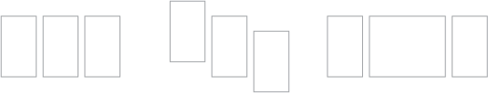

# Project Three--- Triptych
## Description
You will use Illustrator to make a [triptych](https://en.wikipedia.org/wiki/Triptych), or a three-panel artwork.

Now that your technical skills in Illustrator are more refined, you will tell a story or convey an idea using a composition.

## Approach
### Ideation
Before you do any work at all, you need an idea. I recommend viewing examples of triptychs.

The three panel format is very powerful for storytelling purposes. You can convey ideas by breaking them into three parts.

One way is to use different thematic parts:
1. Morning, afternoon, night
2. Past, present, future
3. Birth, life, death
4. Negative, neutral, positive

Or you can use three different subjects _(e.g., three different birds, three different trees, etc.)_

#### Examples
I am a fan of using the three panels to represent _past-present-future_:

1. Here's an [interactive triptych](http://nagu.io/projects/triptych/) I created in grad school.
2. And here's [another example](img/tg.png) that a classmate did.

### Finding inspiration
Before beginning, get ideas.

1. [Google Images](https://www.google.com/search?q=triptych+artwork&source=lnms&tbm=isch&sa=X&ved=0ahUKEwjj8eWYpbrXAhUrxYMKHVdnBScQ_AUICygC&biw=1536&bih=783)
2. [Pinterest](https://www.pinterest.com/search/pins/?q=triptych)
3. [Tumblr](https://www.tumblr.com/search/triptych)
4. [Behance](https://www.behance.net/search?content=projects&user_tags=973925)
5. [Dribbble](https://dribbble.com/search?q=triptych)

### Getting Started
Once you have an idea, decide on the layout you want. I recommend creating three artboards in Illustrator. They do not have to be the same size, or positioned in a specific way. These are all possible layouts:

If you can't decide, just create three artboards each sized `600x800` pixels.

### Iteration
You are expected to work on this regularly. The more often I see your work, the more I can guide you in the right direction. I suggest working 20-30 minutes a day over Thanksgiving break.

## Submission
`CANVAS > ASSIGNMENTS > PROJECT THREE`

I need your Illustrator file and the three images exported from it.

Use `File > Export as...` and export as a `.png`. Check `use artboards` to ensure you get three files.

You will be submitting `a single zip file`. The zip file should contain a folder named `project3_lastname-firstname` that has:

 * Your `.ai` file
 * Exported PNGs of your files

#### **Due Wednesday Nov. 29th at 11:59pm**