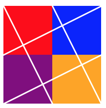

# Homework One --- <small>drawing primitives</small>
## Description
In this assignment, you will familiarize yourself with JavaScript, and the [p5.js](https://p5js.org/) library.

I have set up a simple p5.js sketch, and you will modify it to match the desired result. Instead of having to write all the code from scratch, you are making edits to my code.

  <h6 class="card-text">Your finished sketch will look like this one:</h6>
  

## Process
### Create your pen
Make a new pen on Codepen. Use `settings > JavaScript > Add External Scripts/Pens` and use the search box to add in `p5.js`

### Use p5.js tutorials and resources
Once you've created your pen and imported p5.js, you can get started.

You should consult the official [p5.js reference](https://p5js.org/reference/), which includes examples.

The methods you will want to understand are:
 * createCanvas()
 * fill()
 * stroke()
 * strokeWeight()
 * line()
 * ellipse()
 * rect()

#### Tutorial
You may also like Dan Shiffman's [p5.js tutorials on YouTube](https://youtu.be/D1ELEeIs0j8). He is using Brackets, but we can use Codepen.

## Submit to Canvas
Submit your Codepen URL _(zip)_ to: `CANVAS > ASSIGNMENTS > HW1`

#### **Due Wed Sept 4th @ 11:59pm**