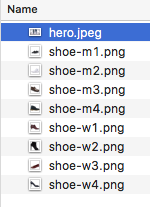
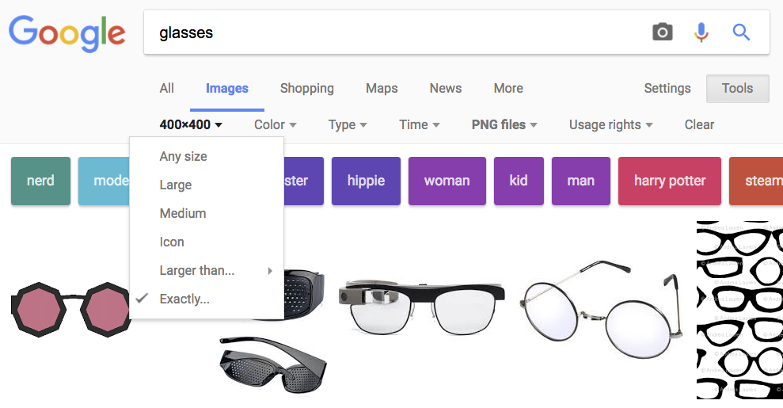

# Project Two - <small>Layouts with CSS `15 points`</small>
## Description
You will use CSS `flexbox` to create a layout for a fictional online shop. This can be almost anything you want - clothing store, sports gear, hotels/vacation. You can also expand on your pizza website from Homework Two if you like; you are encouraged to re-use and modify existing code wherever possible.

<div class="card-block">
  <p class="card-text">I've created an example shoe store website as a reference:</p>
  <a href="../examples/shoes/example.png/" class="btn btn-primary" target="_blank">View Example</a>
</div>

This project may appear daunting at first, but if you are motivated to work on it regularly over the next few weeks, you will do well. I will cover many of the components during class activities so that you have some example code to work with.

#### Using code from references
You are allowed to get code from places like W3Schools.com and css-tricks.com. However, you MUST CITE the source in your code if you plan to do this.

##### Example:

```html
     <!-- from W3Schools: https://www.w3schools.com/css/some-link.asp-->
     <div class="flex-container">
         ...
     </div>
```

### Flexbox Reference
Flexbox is a useful way of organizing CSS elements and creating layouts. You are encouraged to consult these guides:

 * [Scotch.io Visual Guide to Flexbox](https://scotch.io/tutorials/a-visual-guide-to-css3-flexbox-properties)
 * [Scotch.io Flexbox Playground](https://demos.scotch.io/visual-guide-to-css3-flexbox-flexbox-playground/demos/)
 * [W3 Guide to Flexbox](https://www.w3schools.com/css/css3_flexbox.asp)


## Approach

 * Begin with an idea - sporting goods, vacation packages, baking supplies
 * Work at a steady, regularly pace. You have several weeks to complete this assignment, but you should __begin immediately__.
 * Show me your progress each week. The more often I see your site, the more I can help guide you. If you begin your project the week that it's due, I will have little time to help you.
 * Find and download all of the images you need. Keep them in your `img` folder.
 * CLICK THE LINKS in this document and READ THEM. It will save you a lot of work.
 * Keep the code that you write in class - you can use a lot of it for this assignment.

## Components
Project Two is divided into a few main components...

### 1 - Navigation `2 pts.`
You must have a navigation bar with a few links on it. These links don't need to be functional. You may reuse your Homework Two navigation code and modify as you see fit. You can also consult [this guide](https://www.w3schools.com/css/css_navbar.asp) from W3Schools for ideas.

### 2 - Hero Image `4 pts.`
Your site will have a _hero image_. This means a large, visually engaging photograph at the top of your site. You should put the _(fictitious)_ name of the site across the top.

You may use [this guide](https://www.w3schools.com/howto/howto_css_hero_image.asp) from W3Schools as a useful starting point. You may also find [this YouTube tutorial](https://youtu.be/tb_EwQOa_ao) helpful.

#### `Getting an image`
You can get your images from anywhere. You may find [Pexels](https://www.pexels.com/) or Google Images helpful. With Google Images, you can search by size, which may be helpful.

### 3 - Items/products `6 pts.`
Your shop should have a list of items/products/deals.

This is where you will want to use [flexbox](https://www.w3schools.com/css/css3_flexbox.asp). You will create a `.flex-container` and fill it with `.flex-items`. Each `.flex-item` should be a product on your site.

##### Organizing your images
You will want to make an `img` folder and keep your images in there:



#### Getting product images
1. Use Google Images.
2. Type in the name of the product you want _(e.g., glasses)_, followed by a space and `filetype:png` _(or whatever filetype you want)_. This will give you results of "glasses" that are all `png` images.
3. Click 'Tools', then click 'Size' and choose 'Exactly...'. I recommend entering a size like 200x200 or 400x400 for square images.




#### Placeholder images
You might find it helpful to use externally-hosted placeholder images. I recommend [lorempixel](http://lorempixel.com/) as a useful service.

##### Example:
```html
    
```

This will give you a 400x200 pixel placeholder image from the _fashion_ section of Lorem Pixel:

 

### Text
You can use [lorem ipsum](http://www.lipsum.com/) placeholder text, or fill in text as you see fit. The idea of this assignment is to create a prototype; something that communicates a strong idea of a finished product.

### File and folder names `1 pts.`
 * DO NOT use spaces in your filenames. Use hyphens instead
 * DO NOT use capital letters in your filenames
 * Your site folder should be named `project2_lastname-firstname` _(e.g., project2_aguirre-nicolas)_
 * You will submit a `.zip` file. Right-click on your site folder and choose `compress`. Make sure this file is called `project2_lastname-firstname.zip`

### Code Quality `2 pts.`
Your code should:

 * Be free of extraneous whitespaces
 * Use concise, helpful comments
 * Use proper indentation to show structure with nested tags - It should be easy to read for me
 * Follow conventions described in class and in the reading _(e.g., do not capitalize tags, use quotation marks when specifying an attribute)_


## Submission - Canvas
Submit your compressed file _(zip)_ to: `CANVAS > ASSIGNMENTS > PROJECT 2`

#### **Due Friday Oct. 27th at 11:59pm**
