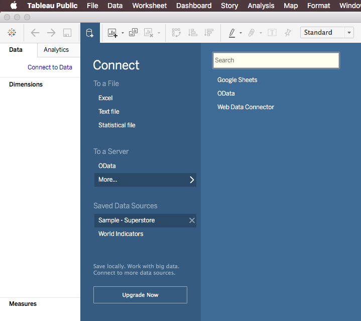

# j362 - Project 3: Tableau Visualization

## Description
For project three, you will create a Tableau-based visualization that you will publish to the web using Tableau Public. The objective of this assignment is to get hands-on experience with Tableau, get familiar with data visualization, and create a useful portfolio piece. You will explore benefits and downsides of different types of visualizations, and create a compelling story using data-driven graphics to support your narrative.

#### Data Source
You will use the sample data `Sample - Superstore` which is included in every version of Tableau. You can find it here:

## Saving and Loading Files
Make sure you know how to save and load your files to/from Tableau Public. We will do the exercise in class, but here's a reminder:

