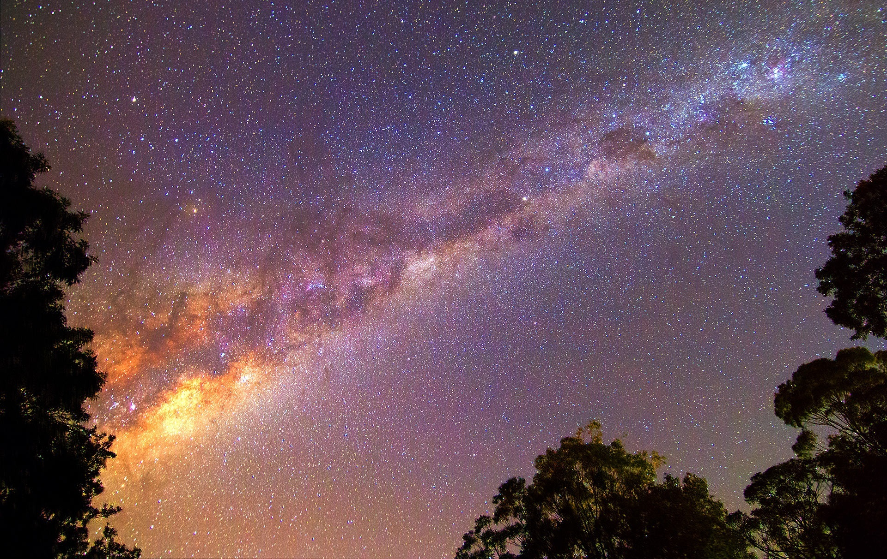

# Homework Two - <small>Composite Imagery</small>
## Description
Homework Two will test your ability to combine images in Photoshop. For this assignment, all you need is a `subject` and a `scene`. You will move the `subject` (e.g., person/object/animal) onto the `scene`.

Suppose I start with two images:

 

The final result might look something like this:

## Approach
You may find [this Adobe tutorial](https://helpx.adobe.com/photoshop/how-to/composite-select-mask.html) useful.

1. Get your images. Google Images and/or Pexels are good starting places.
2. "Cut out" your subject. I recommend doing this with the quick select tool. I highly recommend [this tutorial](https://youtu.be/J_GGu_ZaHbQ) for a good overview of the quick select tool.
3. Load up your scene/background image in another Photoshop tab. Create a new layer and place your cut-out subject on this layer.
4. Apply any filters or effects as needed. Adjust the size and position of your subject as you see fit. You may find [adjustment layers](https://helpx.adobe.com/photoshop/using/adjustment-fill-layers.html) useful for this.
5. Crop the final image as you see fit - remember to consider composition and use of space.
6. Export your file. `File > Quick export as PNG`
7. In the Finder, locate your work folder. `Right-click > Compress`. This will give you a `zip` file. Submit this on Canvas.

## Submission
CANVAS > ASSIGNMENTS > HOMEWORK TWO

You will be submitting `a single zip file`. The zip file should contain a folder that has:

 1. Your Photoshop `psd` file
 2. An image export - `png` format is preferred
 3. Your source images

### Due Date
This assignment is due __Wednesday Oct 4th__ @ 11:59pm.

## Grading
Homeworks are worth `five points` each.

 * _Correctness of submission_ `(1 pt)`. You must submit a single file - `hw2_lastname-firstname.zip`. This archive must include three things:
   * Your Photoshop `psd` file
   * An image export - `png` format is preferred
   * Your source images
 * _Silhouette_ `(2 pt)`. You should demonstrate good understanding of the `quick select tool` or whatever you used to "cut out" the subject. The edges of your cutout should be fairly refined - You don't want to be missing huge chunks of the image.
 * _Effect/Filter/Adjustments_ `(1 pt)` - You are encouraged to use some kind of effect. You might find the `Image > Adjustments` menu useful, or the `Filter` menu. Some ideas are:
    * Adjusting color values, hue, or saturation
    * Desaturating an image
    * Applying a blur/motion effect
    * Applying a filter - crystallize, oil painting, etc.
 * _Composition_ `(1 pt)`. Your final product should show some understanding of composition. For example, you should be conscious in your use of space. Consider things like balance and emphasis in your composition. Use the `crop` tool in PhotoShop to produce a pleasant outcome.