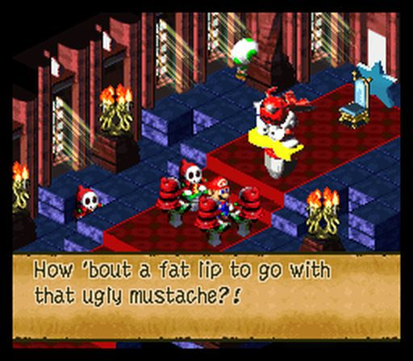
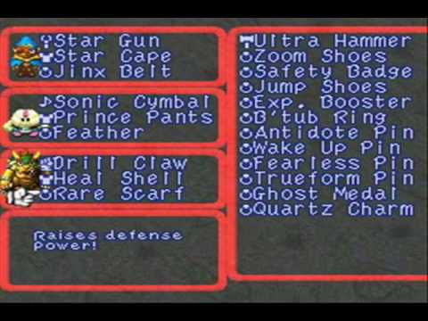

# Project One - <small>Classic Game Replica</small> `15 pts.`
## Description
For Project One, you will choose a classic game in which interfaces are a major part of the game, and re-create a low-fidelity prototype through sketches and Illustrator.

### Objectives
1. Familiarize yourself with the prototyping process
2. Get used to thinking with interfaces
3. Get used to sketching
4. Get used to Illustrator

## Deliverables
You will submit `a single zip file` that contains:

1. Three reference screenshots (any format is fine)
2. Three or more hand-drawn sketches (`.png` or `.jpg`)
4. Illustrator file (`.ai`)
3. Three or more low-fidelity prototypes from Illustrator (export as `.pdf`)

## Process

1. Select a game (you can choose one of mine or propose your own) and find screenshots.
2. Create hand-drawn sketches that resemble the interfaces
3. Re-create them in Illustrator

### 1) Select game, gather screenshots
Pick one of these games:

 * Earthbound (SNES)
 * Mother 3 (GBA)
 * Super Mario RPG (SNES)
 * Chrono Trigger (SNES)
 * Final Fantasy 6 (JP) _(Released as Final Fantasy III US)_ (SNES)

If you want to do a game that isn't on the list, you must get my permission first.

Once you've selected a game, get `three screenshot` files to use as a reference. The screens you've selected should feature `interface elements` (buttons/text/menus).

#### Poor screen selection

#### Good screen selection

### 2) Sketch out interfaces
You will submit `three or more` hand-drawn sketches.

Sketches should be:

 * Scanned images. __DO NOT__ take a picture. I prefer `.png` or `.jpg` format.
 * Legible. I know sketches aren't expected to be neat and precise, but please make sure I can read important text.
 * Black and white sketches.
 * Detailed enough that I can get a feel for the interface, but not so detailed that they resemble a finish product

### 3) Illustrator File
Your submission needs an Illustrator file (`.ai`)

Expectations:

1. Illustrator file should not be massive (<50mb is good)
2. Use layers if necessary. Layers should have meaningful names. _(e.g., avoid 'Layer 1', 'Layer 2', 'Layer 3'...)_
3. You should have three artboards. They should have meaningful names.
4. Use practical fonts; avoid decorative fonts
5. No linked images--- please embed your image files
6. Use of grids/guides is appropriate but not absolutely required.
7. Some attention to detail is observed; if you intend to align two menu items to the left, they should be aligned with precision. Avoid "eyeballing" and try to use precise tools (grid/guide/ruler) wherever possible.
8. You may only use __ONE COLOR__ other than black and white.

### 4) Illustrator Exports
Export as a single `.pdf` file that contains all three artboards.

## Submission - Canvas
You will submit a single `.zip` file with everything. See the __deliverables__ section above for details.

#### **Due Wednesday September 19th @ 11:59pm**