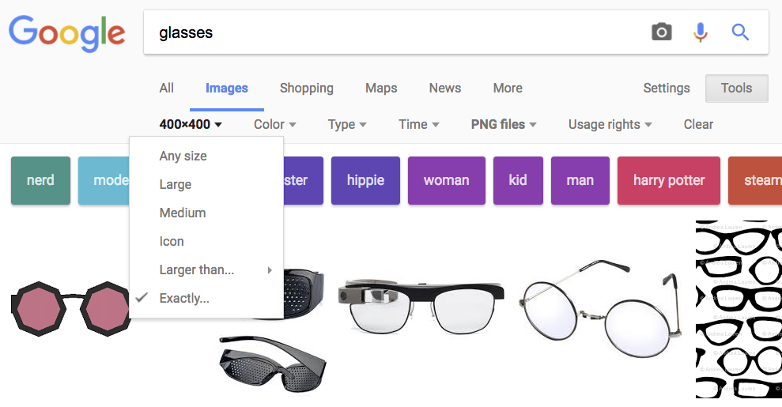

# Project Two --- <small>Layouts with CSS `15 points`</small>
## Description
You will use CSS `grid` to create a layout for a fictional online shop. This can be almost anything you want --- clothing store, sports gear, hotels/vacation. You can also expand on your pizza website from Homework Two if you like; you are encouraged to re-use and modify existing code wherever possible.

<div class="card-block">
  <h2>Examples</h2>
  <ul>
    <li><a href="img/p2-example1.png">Example One</a></li>
    <li><a href="img/p2-example2.png">Example Two</a></li>
    <li><a href="img/p2-example3.png">Example Three</a></li>
    <li><a href="img/p2-example4.png">Example Four</a></li>
    <li><a href="img/p2-example5.png">Example Five</a></li>
  </ul>
</div>

This project may appear daunting at first, but if you are motivated to work on it regularly over the next couple of weeks, you will do well. I will cover many of the components during class activities so that you have some example code to work with.

#### Using code from references
You are allowed to get code from places like W3Schools.com and css-tricks.com. However, you MUST CITE the source in your code if you plan to do this.

##### Example:

```html
     <!-- from W3Schools: https://www.w3schools.com/css/some-link.asp-->
     <div class="grid">
         ...
     </div>
```

## Approach
### Step One: Determine Purpose
 * Begin with an idea --- sporting goods, vacation packages, baking supplies
 * Come up with a `mission statement`. Think about `WHY` your company does what it does. Check out the Visual Identity lecture for more good examples
 * Think about your target audience. Who is this product for? Be specific--- name, age, hobbies, interests, passions, pain points etc.

### Step Two: Define Visual Identity
 * You need to look at A LOT OF websites for inspiration.
 * Here's a great [collection of grid-based websites](https://www.awwwards.com/30-grid-based-websites.html)
 * Here's [another collection](https://www.designspiration.com/save/12847691391/?utm_source=feedburner&utm_medium=feed&utm_campaign=Feed%3A+dspn%2Feveryone+%28Designspiration+-+Everything%29)
 * Bookmark several other websites you can consult for style, site structure, content, purpose, brand, etc.
 * Collect links and images to build a 'stylescape' or moodboard

### Step Three: Build Your Grid
CSS Grid is a useful way of organizing CSS elements and creating layouts. You are encouraged to consult these guides:

 * [CSS-tricks: A complete guide to grid](https://css-tricks.com/snippets/css/complete-guide-grid/)
 * [W3schools: CSS Grid Layout](https://www.w3schools.com/css/css_grid.asp)
 * [Mozilla: Basic Concepts of Grid Layout](https://developer.mozilla.org/en-US/docs/Web/CSS/CSS_Grid_Layout/Basic_Concepts_of_Grid_Layout)
 * Before you actually build the grid, I recommend sketching it on paper.

### Step Four: Fill in Content
 * Decide what's going to go on your site--- text, images, etc.
 * Find and download all of the images you need. Keep them in your `img` folder.

#### `Getting an image`
You can get your images from anywhere. You may find [Pexels](https://www.pexels.com/), [Unsplash](https://unsplash.com/) or Google Images helpful. With Google Images, you can search by size and also resolution, which may be helpful.

#### Items/products
Your shop should have a list of items/products/deals.

This is where you will want to use [CSS Grid](https://www.w3schools.com/css/css_grid.asp). You will create a `.grid` and fill it with some `.item` elements. Each `.item` should be a product on your site. You may want to read up on the [grid-template property](https://www.w3schools.com/cssref/pr_grid-template.asp).

###### HTML
```html
 <div class="grid">
   <!--item 1 -->
   <div class="item">
        <!--put heading here -->
        <!--put image here-->
        <!--put price/description here -->
   </div>
   
    <!--item 2 -->
   <div class="item">
        <!--put heading here -->
        <!--put image here -->
        <!--put price/description here -->
   </div>
 </div>
```

###### CSS
If you wanted a grid with four columns and 10 pixels of spacing between each item, you might do this:
```css
.grid {
   display: grid;
   grid-template-columns: auto auto auto auto;
   grid-gap: 10px;
}
```

##### Organizing your images
You will want to make an `img` folder and keep your images in there:


#### Getting product images
1. Use Google Images.
2. Type in the name of the product you want _(e.g., glasses)_, followed by a space and `filetype:png` _(or whatever filetype you want)_. This will give you results of "glasses" that are all `png` images.
3. Click 'Tools', then click 'Size' and choose 'Exactly...'. For example if I wanted square images I might search for 400x400




#### Placeholder images
You might find it helpful to use externally-hosted placeholder images while you are constructing your site. I recommend [lorempixel](http://lorempixel.com/) as a useful service.

##### Example:
```html

```

This will give you a 400x200 pixel placeholder image from the _fashion_ section of Lorem Pixel:


#### Resizing images
If you images are too large, and they cause your grid to break the page, you might try setting a maximum width on them:

```css
.item img {
   max-width: 100%;
}
```

#### Text Content
Make sure that your text content is thoughtful and relevant. It should be "on brand" with your company's values and mission statement.

### Some Pointers
 * Work at a steady, regularly pace. You have a while to complete this assignment, but you should __begin immediately__.
 * Show me your progress each session. The more often I see your site, the more I can help guide you. If you begin your project the week that it's due, I will have little time to help you.
 * CLICK THE LINKS in this document and READ THEM. It will save you a lot of work.
 * Keep the code that you write in class - you can use a lot of it for this assignment.

## Grading
### Intention and Brand Identity `5 pts.`
 * Site has a clear mission and set of core values
 * Site considers its positioning and target audience
 * Site has a consistent brand identity throughout

### Visual Identity `7 pts.`
__Don't make my eyes bleed.__ This is an opportunity for you to generate an amazing portfolio piece.
 * Site is aesthetically pleasing
 * Site has consistent and cohesive visual style
 * Sizing of elements is intentional--- Make sure your text, nav links, and other elements are appropriately sized. You should vary the size of your heading elements to create a clear hierarchy.
 * Color is used effectively--- Your text should be readable. Your color scheme should be consistent across the page. Avoid HUGE areas of saturated color unless you are doing it very intentionally.
 * __You must turn in a stylescape.__ Include it as `stylescape.pdf`. You should already have this from our participation exercises.

#### Hero Image
Your site will have a _hero image_. This means a large, visually engaging photograph at the top of your site. You should put the _(fictitious)_ name of the site across the top.

You may use [this guide](https://www.w3schools.com/howto/howto_css_hero_image.asp) from W3Schools as a useful starting point. You may also find [this YouTube tutorial](https://youtu.be/tb_EwQOa_ao) helpful.

#### Composition (Structure/Layout)
 * Content is thoughtfully arranged
 * Items are aligned to a grid _(you can get creative; use any kind of grid you like)_
 * Site has a clear 'page flow' and focal points
 * Site demonstrates good use of composition. _(Revisit the Dynamic Composition slides)_
 * Intentional use of space --- Elements should not be too tight/cramped next to each other, but there should not be huge gaps between elements either. Use `margin` and `padding` as needed. I recommend making a container to put your site in. This will keep elements from being too far apart on wide displays.
 * You must have a navigation bar with a few links on it. These links don't need to be functional. You may reuse your Homework Two navigation code and modify as you see fit. You can also consult [this guide](https://www.w3schools.com/css/css_navbar.asp) from W3Schools for ideas.


### File and folder names `1 pts.`
 * DO NOT use spaces in your filenames. Use hyphens instead
 * DO NOT use capital letters in your filenames
 * Your site folder should be named `p2-lastname-firstname` _(e.g., p2-aguirre-nicolas)_
 * You will submit a `.zip` file. Right-click on your site folder and choose `compress`. Make sure this file is called `p2-lastname-firstname.zip`
 * Your folder should include:
    * `index.html` and any other pages you decide to make
    * `styles.css`
    * an `img` folder with your images.
    * `stylescape.pdf`--- your stylescape

### Code Quality `2 pts.`
Your code should:

 * Be free of extraneous whitespaces
 * Use concise, helpful comments
 * Use proper indentation to show structure with nested tags -- It should be easy to read for me
 * Follow conventions described in class and in the reading _(e.g., do not capitalize tags, use quotation marks when specifying an attribute)_


## Submission - Canvas
Submit your compressed file _(zip)_ to: `CANVAS > ASSIGNMENTS > PROJECT 2`

#### **Due Tuesday March 3rd at 11:59pm**
